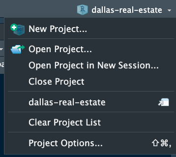
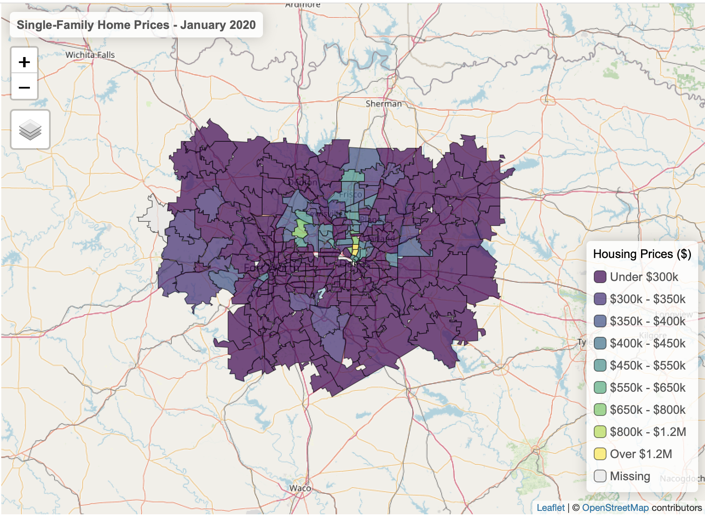
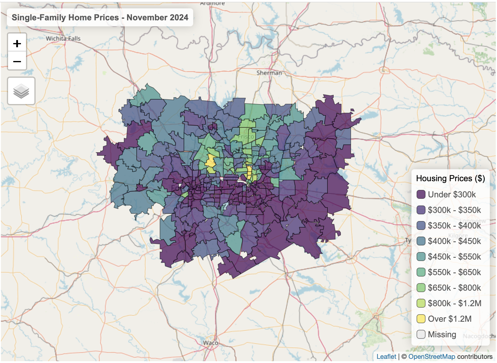
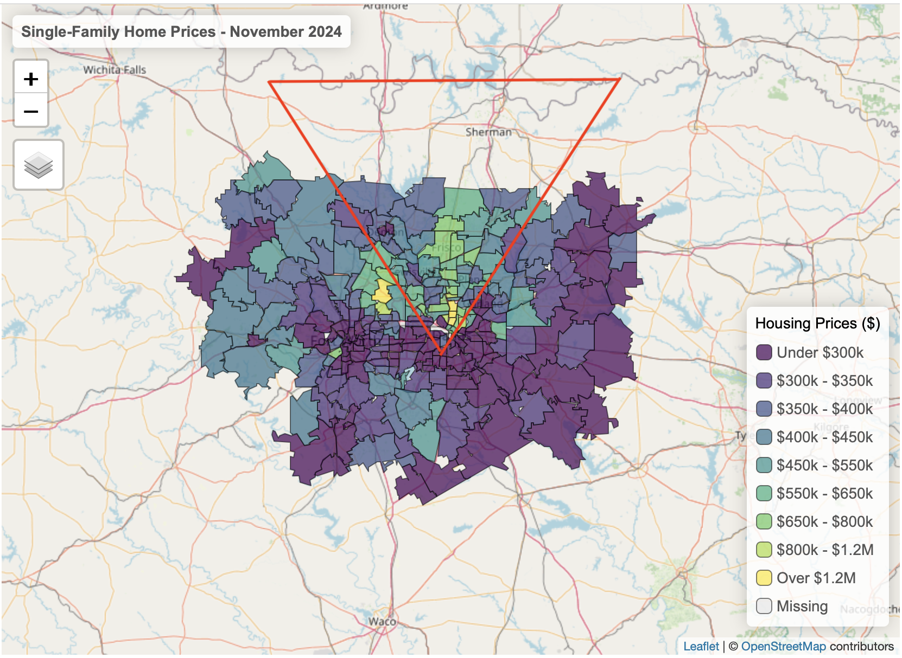
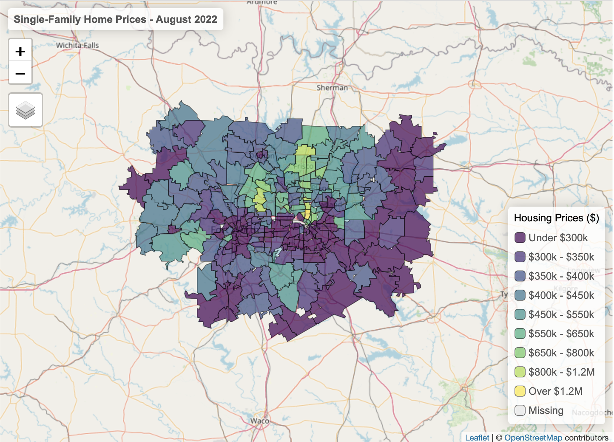
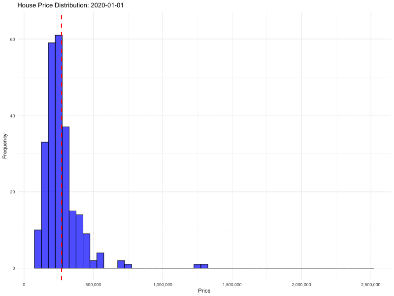
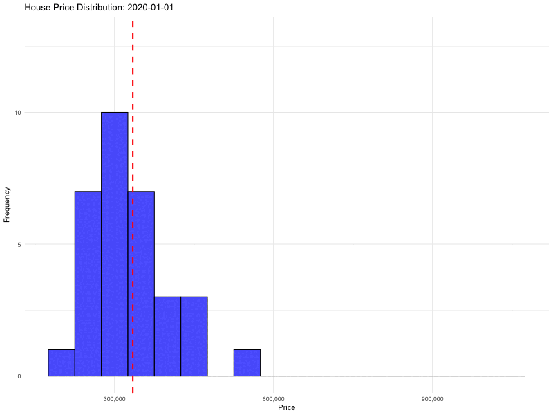
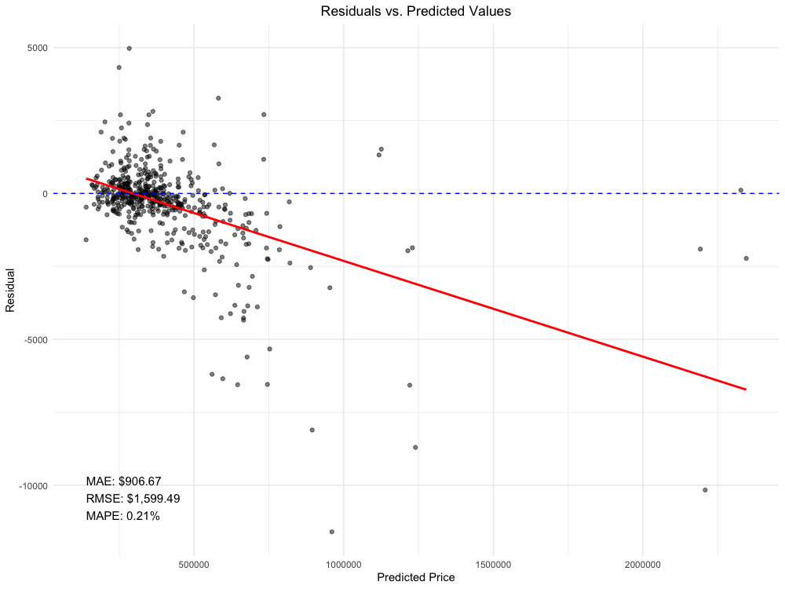

# Dallas Real Estate Market Tool
## Introduction
Hi! Thanks for visiting this repo. I've always wanted to work with RShiny in a more substantive way, and this is my way of atttempting that. The app is a tool that allows for 2 things: 

1. A map showcasing the how the Dallas MSA (Metropolitan Statstical Area) single-family home prices have changed over time. 

2. A secondary panel where you can see, by zip code, how single family home prices have changed over time and also how it compares to the rest of the MSA.

[Check out the app!](https://rohitkandala.shinyapps.io/interactive_map/)

### Project Structure
The repo is structured in the following way:

```plaintext
dallas-real-estate (the repo)
├── analysis
│   ├── ARIMA_deep_dive.R
│   ├── geo_coding.R
│   ├── time_series.R
│   └── zip_code_deep_dive.R
├── interactive map
│   ├── app.R
│   └── rsconnect_folder
│       └── interactive_map.dcf
├── renv
│   ├── .gitignore
│   ├── activate.R
│   └── settings.json
├── .gitignore
├── pngs
├── LICENSE
├── README.md (This file!)
├── dallas-r-project.Rproj
└── renv.lock
```

Sidenote--the .gitignores will not be displayed by default so please go in your termainal and type the following to see and adjust them to your liking:

```bash
$ ls -a
```
If you wish to open one of the .gitignores (the one at the root level is the .gitignore for the repo and renv also has one specifically), then please go to the appropiate directory level in your terminal, and type:

```bash
$ nano .gitignore
```

### Data Access
As you can see, there's no data! That's on purpose as Github doesn't work well with large data files, and I think it's generally bad practice to include data in Github. Here's how you can find the file:

1. Go to Zillow's [Housing Data webpage](https://www.zillow.com/research/data/)

2. Go to **Home Values** (first subheading), and then click the following:  

   A. For **Data Type**, click "ZHVI Single-Family Homes Time Series ($)"  
   B. For **Geography**, click "ZIP Code"

Downloading this data is surprisngly difficuly because Zillow spits out a web page with text data (WHY?!?!), but at least on Mac, you can right-click the blue "download" button and click "download linked file as", and save it as a csv. The file should be ~113MB. 

### Reproducability
Since this a Creative Commons license project, feel free to fork this repo and do far cooler work on this dataset--I just ask that you credit me if you use my code.  

If you wish to run this app locally, and you may need to because free cloud computation is limited and geographical data is quite "heavy", then please follow these steps:

1. Download this repo. 

2. [Download RStudio.](https://posit.co/download/rstudio-desktop/)

3. Open the ".Rproj" file. This ensures the path(s) are correct and the R code runs on your machine. Here's a screenshot where that exists:



4. **IMPORTANT**: *You will need to create a "data" folder at the same level as the analysis, interactive_map. If you don't do this, then the app will not work.*

5. Run the following files in sequence after downloading the CSV from Zillow's Economic Research website:  

   A. `time_series.R`  
   B. `geo_coding.R`

6. In the R console, run the following commands:

To start the app:

```r
library(rsconnect)
rsconnect::deployApp("interactive_map")
```

To terminate the app:

```r
rsconnect::terminateApp(appName = "interactive_map")
```

If it's your first time using R/RStudio, then there are a lot of packages to download and the _renv.lock_ file should take care of package reproducability. If that doesn't work, then I have my libraries at the top of my R scripts so use that as a guide if all else fails. 

### Data Quirks
Every dataset has its quirks and this is no different! A big note is that Zillow's ZIP column is not actually "Zip", but rather is "ZCTA5CE10". This confused me royally, but hopefully you **read this** and won't make the same mistake. 

Zips also change over time, and how they're counted can also change. I should've done a better job of this, but since that happened rarely within a five-year timespan, I often remove the 1-2 observations where it did happen. 

Also some questions that I anticipate, and are completely fair to ask:

1. **Why is there a renv?**  
   - I had a lot of trouble publishing the Shiny app to shinyapps.io (where this is hosted), and long story short, there were package issues — especially with the `arrow` library. If you can run it without a `renv`, then hats off to you and tell me how you did it.  

2. **Why is the data so heavy?**  
   - This is extremely fair. Geographical columns can be computationally intense to deal with, and I tried to mitigate this with the following lines of code in *geo_coding.R*:

   ```r
   ### Simplifying geometries:
   shiny_df <- shiny_df |>
     st_simplify(dTolerance = 50)
   ```

   As well as the compression:

   ```r
   ### Saving as an RDS file:
   saveRDS(shiny_df, "interactive_map/shiny_df.rds", compress = "xz")
   saveRDS(regional_avg, "interactive_map/regional_avg.rds", compress = "xz")
   ```

   While the saved dataframes are only a couple hundred KB, when loaded into R, they're a couple of MB. This becomes an issue even with a small amount of web traffic, as my free cloud instance is limited to 1 GB. Fun fact, R does have automatic garbage collection, but that doesn't help as much and you can see an object's size in the environment with the following code in the console:

    ```r
    object.size("OBJECT_IN_QUESTION")
   ```

3. **Why didn't you use an API?**  
   - I wanted to — it would've been cooler! I'm chatting with Zillow to see if we can make this work, but you need to request access, and the process takes weeks.  

4. **What's up with the ZIPs 75225 & 75205?**  
   - I probably should've excluded them from the analysis and visualization. People don't tend to buy real estate, especially single-family homes, in the middle of the city. However, they exist and slightly skew the average upwards. 

5. **What's up with the legend?**  
   - Astute observation, dear student. The reason for this is because, in 2020, the median single-family home price was $241,001, and in Nov. 2024, it was $348,836. This legend is subjective, but I feel that it's good at capturing price changes. Moreover, in the analysis section I'll cover the "Northern Suburbs", and the legendy fits particularly well.

6. **Why did you aggregate by ZIPS?**  
   - Perhaps neighborhood would've been better, but ZIPs were easier to work with. Granted ZIPs don't do a great job of capturing cultural and demographical trends, and there's no good way of knowing the price distribution within each zip, and that's crucial with assesing real estate prices. 

7. **Why did you build this? Are you a secret NIMBY?**  
   - Quite the opposite! I thought this could be fun, and someone I know wanted it.

## Analysis
### Different Codes for Different Roads
This analysis only covered Jan. 2020 till Nov. 2024, and has predicted values Dec. 2024 & on. In that roughly five year time span, the Dallas MSA's average home price increased from $270,213 to $403,058. It still continues to be affordable when compared to other metro areas, but this is still a 49.2% increase which is rather stunning. 

Hell, even the [Dallas Fed wrote](https://www.dallasfed.org/research/economics/2021/1228) an article explaining why this was happening. So even with interest rates hovering around 6-7%, the Dallas real estate market, much like the nation itself, shows no real signs of price cooldown. The increase is also stark when you realize that the MSA is MASSIVE! It combines the cities of Dallas, Fort-Worth, and Arlington as well as suburbs (sometimes classified as cities) that reguarly have 100k+ people. In square miles, it's almost twice as large as the great state of CT--where I'm from!

Here's Dallas in Jan. 2020:


And here's Dallas in Nov. 2024:


Sheesh!

One specific pattern also emerges when looking at the Dallas MSA on a map. The Northern portion of the Dallas MSA not only starts out significantly pricier than the rest, but also experienced an above-average growth in prices. 

Here's my attempt at drawing that "V":


I am going to call this the "Northern Suburbs". A portion of the Dallas MSA with above-average single-family home prices. Given that Frisco seems to be at the center for all of this, this makes sense.

Forgive me, but as an Indian-American, Frisco is literally a home away from home--first place I saw in America was around Frisco! It has great schools, facilities, and infrastructure.  

#### Real Estate Boom & Bust...and Boom?
The 2020 vs. 2024 framing misses something _very important_. Prices in 2024 aren't that much different from the peak of 2022's prices. Here's the MSA in Aug. 2022:



Aug. 2022's mean and median are $402,999 and $358,658 while Nov. 2024's mean and median are $403,058 and $349,836. 

The predictive model has Dec. 2025's prices at a mean of $414,169 and a median of $345,609. It's interesting that the median has gone down, and is predicted to decrease further. Without further context, that could either be that the supply of single-family has increased and/or the market's also cooling off. 

Keep in mind that the national interest rate [has remained similar to 2022 levels.](https://ycharts.com/indicators/30_year_mortgage_rate?) Perhaps the market did cool off and interest rates are a lagging indicator, but someone smarter and better than me at causal inference should, and probably already has with a large monetary incentive, figured it out. Shoutout to that person. 

#### What's Good in the MSA?
Here's a GIF of the distribution of single-family homes. The dashed line is the mean:



Aren't GIFs fun? Ok fine--I promise not to do it again.

The Dallas MSA has a long-tail distrubution, especially with the 75225 & 75205 zips. The boom & bust & slightly less exciting boom is evident with the mean moving quickly initially, being scaled back slightly for a couple of months, and then slowly picking back up. 

##### Big Movers
We know the Dallas MSA had an average price increase of 49.2% per single-family home, but of course, that is not equally distributed. How goofy--so much of stats is just inspecting hetrogenous chunks of data. Here's where growth was the highest between 2020 & 2024, and it's sorted by the "Change 2020-2024 (%)" column:


| ZIP Code | Price (2020) | Price (2022) | Price (2024) | Change 2020-2022 (%) | Change 2022-2024 (%) | Change 2020-2024 (%) |
|:---------:|--------------:|--------------:|--------------:|---------------------:|---------------------:|---------------------:|
| 75205     | 1,293,296     | 1,728,531     | 2,308,470     | 33.65               | 33.55               | 78.50               |
| 75225     | 1,231,420     | 1,600,109     | 2,175,202     | 29.94               | 35.94               | 76.64               |
| 75078     | 457,952       | 676,421       | 788,032       | 47.71               | 16.50               | 72.08               |
| 76092     | 704,194       | 991,384       | 1,206,827     | 40.78               | 21.73               | 71.38               |
| 75035     | 396,682       | 561,413       | 663,571       | 41.53               | 18.20               | 67.28               |
| 76105     | 100,605       | 136,913       | 167,442       | 36.09               | 22.30               | 66.44               |
| 75401     | 115,602       | 175,928       | 191,871       | 52.18               | 9.06                | 65.98               |
| 75254     | 572,057       | 719,547       | 948,002       | 25.78               | 31.75               | 65.72               |
| 75009     | 366,051       | 527,670       | 605,622       | 44.15               | 14.77               | 65.45               |
| 76270     | 290,475       | 405,429       | 479,013       | 39.57               | 18.15               | 64.91               |


Our two favorite rich people zips (75205 & 75225) show up at the top and most of these are concentrated within the Northern & Western suburbs. The exception being _76105_ which is located near Fort Worth and had the lowest initial price out of all the zips. Now let's see the lowest growth areas!


|ZIP Code | Price (2020)| Price (2022)| Price (2024)| Change 2020-2022 (%)| Change 2022-2024 (%)| Change 2020-2024 (%)|
|:--------|------------:|------------:|------------:|--------------------:|--------------------:|--------------------:|
|76670    |       191036|       250557|       230120|                31.16|                -8.16|                20.46|
|75246    |       319601|       379061|       392973|                18.60|                 3.67|                22.96|
|75204    |       457170|       540797|       570788|                18.29|                 5.55|                24.85|
|75125    |       221197|       287067|       278791|                29.78|                -2.88|                26.04|
|75219    |       458728|       533677|       584027|                16.34|                 9.43|                27.31|
|75201    |       573884|       673084|       742305|                17.29|                10.28|                29.35|
|75126    |       246846|       333789|       325478|                35.22|                -2.49|                31.85|
|75226    |       240848|       307342|       318346|                27.61|                 3.58|                32.18|
|76066    |       306106|       380387|       407367|                24.27|                 7.09|                33.08|
|76102    |       166619|       204261|       222962|                22.59|                 9.16|                33.82|


I think it's crucial to point out that even the zip code with the lowest growth, _76670_ increased by 20.46%. Wow. Most of these zips are located close to or within the city of Dallas in the central & western parts of the city. The exceptions being _76670_, _75125_, _76066_, and those are just really far from the center. 

#### "Northern Suburbs"
I lied--I love GIFs about data. Here's a GIF of the distribution of single-family homes in the "northern suburbs":



The Northern Suburbs comprise of the following zips:

```
75033 75034 75035 75036 75056 75057
75065 75067 75068 75069 75070 75071
75072 75074 75075 75078 75080 75081
75082 75093 75094 76208 76210 76227
75028 75032 75001 75002 75006 75007
75010 75013 75023 75252 75254
```
As I said, it's the general "V" shape where Frisco's the center; it's basically the area between Lewsiville & Lavon Lake. 

This area is more sensative to price--it increases rapidly and sheds price a little less quickly. The average is $334,379 in Jan. 2020 and ends up at $514,308 in Nov. 2024. Of course, there was a near-record high in Aug. 2022 with an average home price of $512,354, but that decreased to a low of $493,503 before rebounding to current prices. 

##### Big Movers
Within the Northern Suburbs, where's the growth happening? Here's where!


|ZIP Code | Price (2020)| Price (2022)| Price (2024)| Change 2020-2022 (%)| Change 2022-2024 (%)| Change 2020-2024 (%)|
|:--------|------------:|------------:|------------:|--------------------:|--------------------:|--------------------:|
|75078    |       457952|       676421|       788032|                47.71|                16.50|                72.08|
|75035    |       396682|       561413|       663571|                41.53|                18.20|                67.28|
|75254    |       572057|       719547|       948002|                25.78|                31.75|                65.72|
|75013    |       419276|       576346|       673037|                37.46|                16.78|                60.52|
|75034    |       426706|       592189|       683730|                38.78|                15.46|                60.23|
|75071    |       327842|       464221|       519562|                41.60|                11.92|                58.48|
|75070    |       317922|       443739|       502670|                39.57|                13.28|                58.11|
|75094    |       374820|       510603|       592548|                36.23|                16.05|                58.09|
|75093    |       470202|       603224|       739658|                28.29|                22.62|                57.31|
|75002    |       299311|       409247|       470003|                36.73|                14.85|                57.03|


And where's growth slower compared to the average?


|ZIP Code | Price (2020)| Price (2022)| Price (2024)| Change 2020-2022 (%)| Change 2022-2024 (%)| Change 2020-2024 (%)|
|:--------|------------:|------------:|------------:|--------------------:|--------------------:|--------------------:|
|76227    |       271227|       372624|       389280|                37.38|                 4.47|                43.53|
|76208    |       288974|       385834|       415752|                33.52|                 7.75|                43.87|
|75057    |       218637|       274229|       315529|                25.43|                15.06|                44.32|
|75006    |       250287|       308358|       362072|                23.20|                17.42|                44.66|
|75067    |       255293|       324627|       371711|                27.16|                14.50|                45.60|
|75080    |       311865|       379617|       457014|                21.72|                20.39|                46.54|
|75001    |       351731|       429031|       518728|                21.98|                20.91|                47.48|
|75007    |       278553|       352191|       411441|                26.44|                16.82|                47.71|
|75074    |       262502|       336276|       387747|                28.10|                15.31|                47.71|
|76210    |       268783|       360088|       398845|                33.97|                10.76|                48.39|

This is a lot of numbers, but fundamentally the greatest growth is happening within already-developed suburbs close to Frisco, while formerly rural areas such as Aubrey and Flower Mound aren't growing as quickly. This is perfectly OK, as the lowest-growth zip, _76227_, grows at a higher rate than the MSA average of 42.9%.

Areas like Frisco and Plano have seen significant price growth, but as they become more developed and saturated, future growth may slow. Conversely, more rural areas like Aubrey and Flower Mound are still in the process of developing key amenities, which may limit rapid growth in the short term but could lead to gradual, long-term appreciation as demand spreads further out. 

### Is the Time Series any Good?
#### ARIMA Error(s) Overview
Below is a graph of the residuals with the solid red line being a negative y = -x line:



Those metrics are really promising! Especially the MAPE percentage. However, it seems like the ARIMA model is worse at predicting expensive outliers so the RMSE is higher. But even then, this model is well-fitted. In fact, I would say we **greatly overfitted to our own detriment.**

Perhaps one reason is because we based the ARIMA solely on "price" as a feature, and there are many more features that give us valuable information. Moreover, I think a more complex ML model with a more robust train/test structure could've been more generalizable. 

#### Didn't Zillow do this? And Poorly?
Yes. Zillow infamously [tried to predict housing prices in 2021 and failed spectacularly.](https://www.nytimes.com/2021/11/02/business/zillow-q3-earnings-home-flipping-ibuying.html) This is because predicting housing prices, more so than other commodoties, is more difficult because house values are subjective--especially single-family homes!

Sure there are features that dominate the value such as: location, nearby amenities, number of bedrooms and bathrooms, house age, etc, but they don't encompass all the value. A lot of the house's value is based on actually seeing the house--which introduces a lot more variance than say buying a stock or index fund. 

That being said Zillow, I am _for hire_ and applaud the effort. Happens to the best of us. 

## General Takes
### Personal Learnings
Like any good coding project, this took me way longer than I anticipated but I also learned a lot. Here are some of those lessons:

1. Building for traffic is hard and probably expensive. In fact, this app will probably crash if more than 9 people look at it consecutively. 

2. Geographic data is a different beast entirely. 

3. Any good data analysis is based on context.

4. Zips may be a bad way to understand real estate data. 

5. Graphic Design is _NOT_ my passion. 

_A note on LLMs_: I feel better that the machine gods won't take over as I sometimes use LLMs when coding. LLMs have a long way to go with data science as a lot of custom questions require a lot of context and assumptions--which are hard to calculate using matrices. I feel solid about the future, but there will be fewer of us because we can each do more so that'll be tough. 

### Other Applications
In no particular order, here are some other cool things you can do with this dataset:

1. Develop a more robust predictive model.

2. Join it with other datasets such as crime, education, demographics, historic events, etc. 

3. I did this with single-family homes--explore other types of homes!

4. Pick a different time frame. 

5. Code this in Python (lol)

6. Do this with other areas!

And so much more. You can just do things!